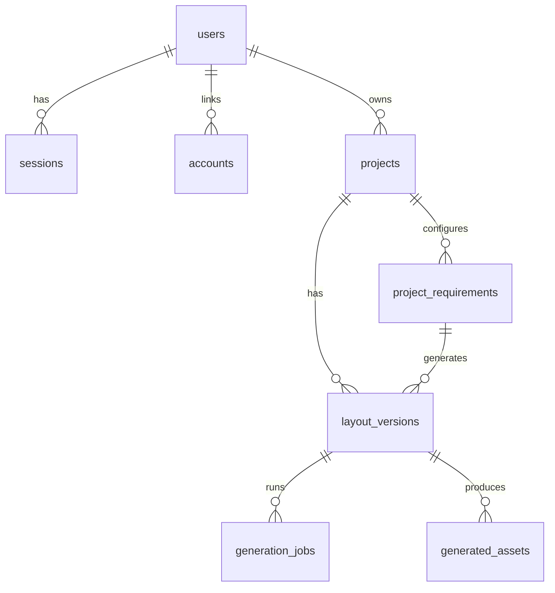

# BrickPilot — The After-Hours Drafting Table

**BrickPilot** is a dark-only, high-contrast AI residential feasibility studio designed for homeowners and residential designers exploring detached houses (from Ground-only up to G+3). It acts as an architect’s calm final review: a digital drafting table of quiet graphite surfaces, structured copper rules, warm ivory typography, and decisive orange commitments.

Instead of generating generic AI images that lack physical validity, BrickPilot leverages a robust three-stage pipeline to produce constructible, dimensionally-accurate residential concepts:
1. **Natural Language & Guided Intake** pre-fills structural constraints and household desires.
2. **A Deterministic Spatial Partitioner & Layout Engine** calculates geometric room alignments, shared walls, stairs, and door/window placements.
3. **Generative Visualizations** ground 3D massing screenshots and 2D floor plans into photorealistic exterior and interior concepts using state-of-the-art AI.

---

## 🏗️ Core Architecture & Pipeline

Unlike simple generative AI wrappers, BrickPilot separates intent parsing, spatial geometry calculation, and visual styling:

```
[ Natural Language / 5-Step Wizard ]
                  │
                  ▼
   [ Structured Requirements JSON ] (Zod validated)
                  │
                  ▼
  [ Deterministic Layout Generator ] (Partitions footprint, stacks multi-storey, routes stairs)
                  │
                  ▼
     [ Canonical Building Model ] (Graph of rooms, openings, and shared walls)
                  │
                  ├──────────────────────────────┐
                  ▼                              ▼
    [ Deterministic Compliance ]     [ Layered SVG Coordinate Plane ]
  (Setbacks, Stack, Reachability)    (Presentation/Architectural/Print viewports)
                  │                              │
                  ▼                              ▼
     [ Regional Cost Engine ]            [ Three.js Massing ]
 (CPWD packs, native INR ranges)      (3D Orbit camera, floor-explode)
                  │                              │
                  └──────────────┬───────────────┘
                                 ▼
                         [ Replicate API ]
                   (Grounded gpt-image-2 render)
                                 │
                                 ▼
                    [ Feasibility Deck & PDF ]
```

---

## 🌟 Key Features

### 1. Guided & NL Intake Wizard
* **Dual Input Interface:** Start with a natural language description (e.g., *"3BHK east-facing Vastu home for a family of 4 on a 30x50 plot"*) which is parsed via LLM into structured parameters, or complete a structured 5-step questionnaire.
* **Granular Constraints:** Captures exact site bounds (width/depth), road edges, stair width preferences, per-floor room programs, regional styles, and target budgets.
* **Safe Fallbacks:** Robust Zod re-ask loops and curated offline fixtures ensure the engine degrades gracefully instead of crashing on irregular inputs.

### 2. Deterministic Spatial Layout Engine
* **Footprint Partitioning:** Recursively slices the site area (incorporating setback guidelines) to tile rooms perfectly with zero overlaps or empty gaps.
* **Multi-Storey Stack (G through G+3):** Aligns a vertical staircase core across all floors, stacks wet areas (kitchens/bathrooms) systematically, and supports setbacks on upper floors.
* **Circulation & Accessibility Graph:** Validates that every room is reachable. Identifies and blocks layout candidates that force users to traverse private rooms (like bedrooms or bathrooms) to access other spaces.
* **Opening Placement:** Automatically calculates optimal locations and swing arcs for doors and window placements based on room orientation and road edges.

### 3. Compliance Validation & Scorecard
* **Setback Check:** Flags outline boundaries that violate zoning clearances.
* **Vertical Wet-Dry Stacking:** Warns when toilets stack directly above dry areas (like living rooms or kitchens).
* **Area Allocation & Capacity:** Compares minimum requested room sizes against usable floor areas to determine design efficiency.
* **Explanatory AI Advice:** Provides human-readable advisory explanations for warnings, offering actionable suggestions to resolve issues without silently editing coordinates.

### 4. Layered 2D SVG Coordinate Viewport
* **Interactive Viewport:** Fully vector-based drafting board with contained 100%–300% zoom, pan, and fit capabilities (no heavy map-engine wrappers).
* **Display Presets:**
  * **CAD Dark:** High-contrast graphite canvas with ivory geometry and copper rules.
  * **Paper Light:** Printable format with standard black lines.
  * **Zoning Overlay:** Color-blind-safe room usage overlays.
* **Layer Toggles:** Independently hide/show walls, furniture, openings, room labels, dimensions, title blocks, schedules, and legends.

### 5. Regional Cost Estimator
* **Local Currency Support:** Renders native budgets (INR for India) without relying on inaccurate currency conversions.
* **CPWD-Indexed Calculations:** Features local cost rate packs (like CPWD-derived Delhi indices) with configurable parameters for finishes, services, structural materials, site works, and contingencies.

### 6. Three.js 3D Massing & Generative Renders
* **WebGL Orbit Viewer:** Explore the building's physical massing in 3D. Supports floor-explode views and roof cutaways.
* **Grounded Generative AI:** Captures isometric, front, and top-down screenshots of the Three.js massing. These serve as visual reference inputs for the Replicate `openai/gpt-image-2` model, producing photorealistic exterior and interior renders that align with the computed layout.

### 7. Interactive Deck & PDF Compilation
* **Presentation Mode:** Renders pages containing architectural sheets, site layouts, floor schedules, validation reports, and renders.
* **Vector PDF Export:** Compiles drawing sheets into a paginated, vector-crisp PDF for printing or sharing.

---

## 🛠️ Tech Stack & Integrations

* **Framework:** Next.js (App Router, v16.1.7) & React 19.2.4
* **Styles:** Tailwind CSS v4.2.1 (configured via `@tailwindcss/postcss`) + custom CSS variables.
* **Database:** PostgreSQL + Drizzle ORM (v0.45.2) + Drizzle Kit (v0.31.10)
* **Auth:** Better Auth (v1.6.9) with Email/Password & Google OAuth. Public signup is disabled; access is limited to seeded users.
* **Asset Storage:** Cloudflare R2 / AWS S3 compatibility
* **LLM Gateway:** MiniMax M3 via Fireworks API (JSON Mode)
* **Image Generation:** GPT Image 2 via Replicate
* **Graphics:** Three.js
* **Test/Scripts Runtime:** Bun

---

## 📊 Database Schema



* **`users`**: User records featuring roles: `owner` (system admin) and `judge` (restricted evaluator).
* **`projects`**: Top-level containers for residential site-studies.
* **`project_requirements`**: Immutable history of versioned intakes (input constraints, dimensions, room programs).
* **`layout_versions`**: The compiled design scheme. Stores the computed spatial partition coordinates, validation logs, cost estimates, selected schemes, and AI advisory logs.
* **`generation_jobs`**: Job queue tracing external API callbacks (Replicate render tasks & Fireworks LLM tasks).
* **`generated_assets`**: Links to persisted assets (vector PDFs, SVG layouts, and AI-generated concepts) stored in Cloudflare R2.

---

## 🎨 Design System (`DESIGN.md`)

BrickPilot features a strict dark-only drafting-board layout spec:

* **Graphite Ink (`#090908`)**: The page background.
* **Charcoal Surface (`#171512`)**: The board and container surface card.
* **Drafting Copper (`#c97940`)**: Architectural lines, borders, and sub-labels.
* **Decision Orange (`#ff4e00`)**: Reserved exclusively for primary actions and terminal highlights (must consume < 10% screen space).
* **Warm Ivory (`#fff6ea`)**: Primary title text and action labels.
* **Lamp-Down Muted (`#b5a697`)**: Descriptive body copy and metadata.
* **Fonts:** Display headers use *Iowan Old Style* (Palatino fallbacks); body text and labels use *Avenir Next* (Gill Sans fallbacks).
* **Corners:** Sharp, square borders (`0px` border radius). Cards use hard-edged offsets (`10px 11px 0 rgba(...)`) instead of fuzzy gradients or drop shadows.

---

## 🚀 Getting Started

### Prerequisites
* [Bun Runtime](https://bun.sh/) (v1.1 or higher)
* [PostgreSQL](https://www.postgresql.org/) (Local database server)

### 1. Clone & Install Dependencies
```bash
bun install
```

### 2. Configure Environment
Copy the example environment template and populate it with your API keys:
```bash
cp .env.example .env.local
```
Fill in the variables in `.env.local`:
* Database URL
* `BETTER_AUTH_SECRET` (generate a secure 32-character string)
* `FIREWORKS_API_KEY` & `REPLICATE_API_TOKEN`
* Cloudflare R2 Credentials (`R2_ACCOUNT_ID`, `R2_ACCESS_KEY_ID`, `R2_SECRET_ACCESS_KEY`)

### 3. Database Initialisation
Create the database tables and apply migrations:
```bash
bun run db:generate
bun run db:push
```

### 4. Seed Seeded Logins
Populate the database with pre-configured accounts (owner and judge roles) and demo projects:
```bash
bun run db:seed
```
*Default Seeded Credentials:*
* **Judge:** `judge@brickpilot.demo` / (configured password in env)
* **Owner:** `owner@brickpilot.demo` / (configured password in env)

### 5. Run the Preflight Connectivity Check
Before booting, confirm the database, LLM gateway, and Replicate services are reachable:
```bash
bun run preflight
```

### 6. Start the Development Server
```bash
bun run dev
```
Open `http://localhost:3000` in your browser.

---

## 🧪 Testing

The project maintains a rigorous, high-coverage unit and integration test suite (ignoring gitignored planning and reference tools):

```bash
bun run test
```

For End-to-End browser validation, run:
```bash
bun run test:e2e
```
